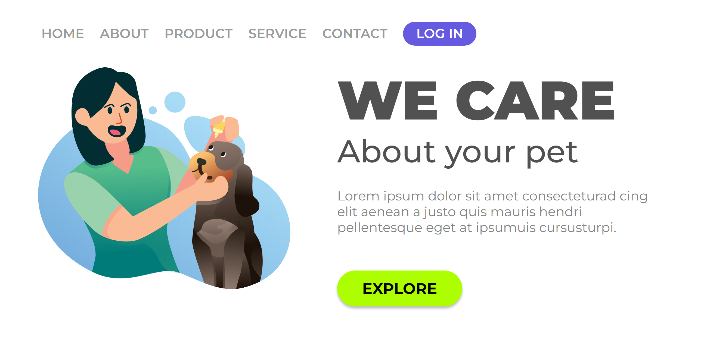

<h1>Projetos DevClub</h1>

  

    Projetos desenvolvidos durante o curso da plataforma DevClub.
  

   

  <table>
    <thead>
      <tr>
        <th align="center">#</th>
        <th align="center">Projeto</th>
        <th align="center">Online</th>
      </tr>
    </thead>
    <tbody>
    <tr>
        <td>01</td>
        <td><a href="./javascript/README.md">Javascript</a></td>
        <td align="center">
          
        </td>
      </tr>
      <tr>
        <td>02</td>
        <td><a href="./we-care/">We Care</a></td>
        <td align="center">
          
        </td>
      </tr>
      <tr>
        <td>03</td>
        <td><a href="./wide-coverage-location/">Wide Coverage Location</a></td>
        <td align="center">
          
        </td>
      </tr>
      <tr>
        <td>04</td>
        <td><a href="./shopping-mobile/">Wide Coverage Location</a></td>
        <td align="center">
          
        </td>
      </tr>
    </tbody>

  </table>

   
