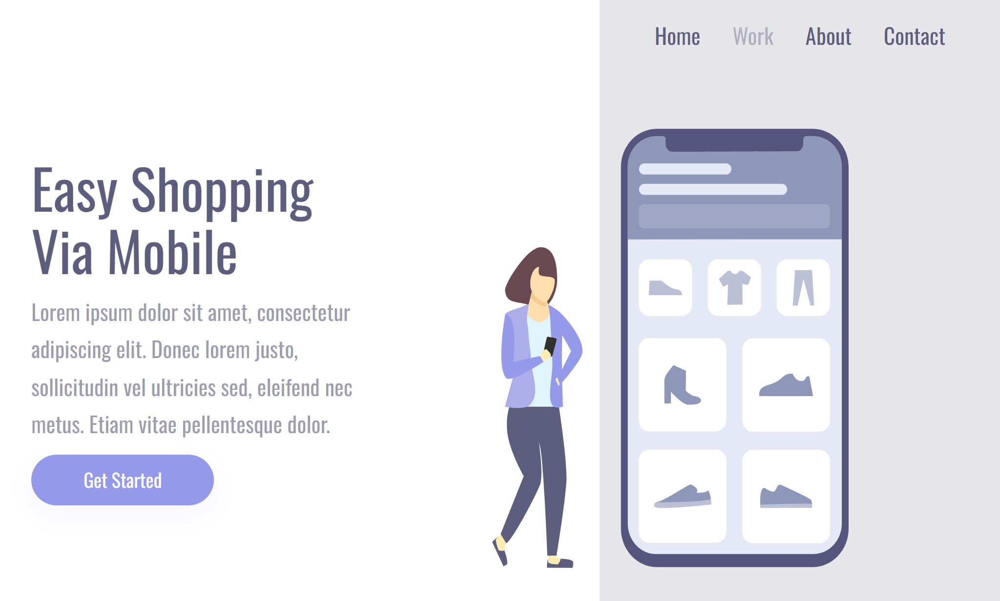

# Easy Shopping Via Mobile

Projeto simples para treinar HTML e CSS.

[Projeto online](https://barbaraishioka.github.io/devclub/shopping-mobile)

[Figma](https://www.figma.com/file/NLeHPJXuYE08PPmRce9nhP/Shopping-via-mobile-illustration)



## Tecnologias

- HTML
- CSS

## Instalação

```bash
git clone https://github.com/barbaraishioka/devclub/shopping-mobile.git

cd devclub/shopping-mobile
```

## Licença

Este projeto está licenciado sob os termos da Licença MIT.
