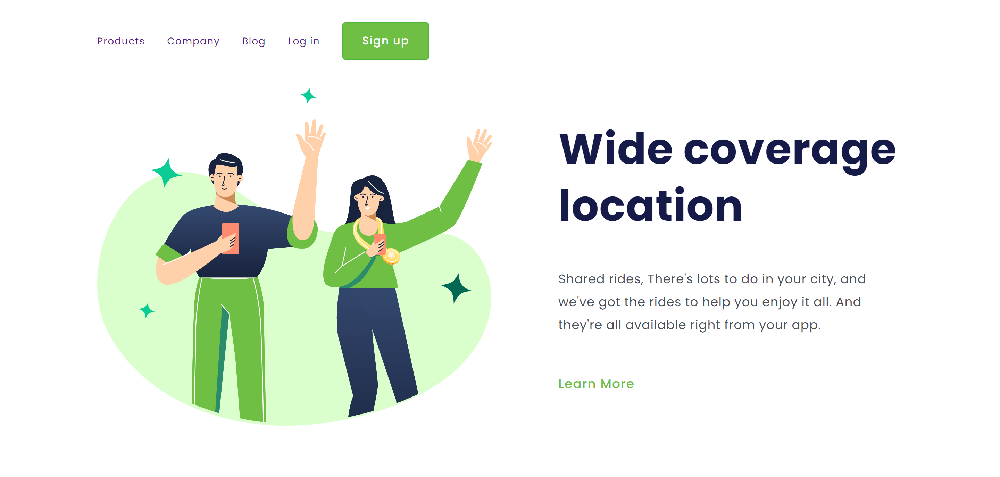

# Wide Coverage Location

Projeto simples para treinar HTML e CSS.

[Projeto online](https://barbaraishioka.github.io/devclub/wide-coverage-location)

[Figma](<https://www.figma.com/file/LzA0ntQdfERw4z41hxvLSs/13.-(Positive)-Congratulation-You-get-40-point-for-your-ride?node-id=0%3A1&_gl=1*1uhyed7*_ga*OTg2MzE0NDY3LjE2Njk0MDY2ODc.*_ga_37GXT4VGQK*MTY5MTAxMDcyMy4zMjIuMS4xNjkxMDEwOTM5LjAuMC4w>)



## Tecnologias

- HTML
- CSS

## Instalação

```bash
git clone https://github.com/barbaraishioka/devclub/wide-coverage-location.git

cd devclub/wide-coverage-location
```

## Licença

Este projeto está licenciado sob os termos da Licença MIT.
